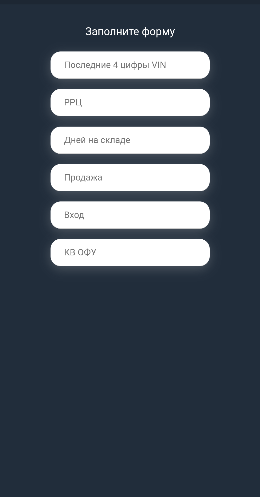
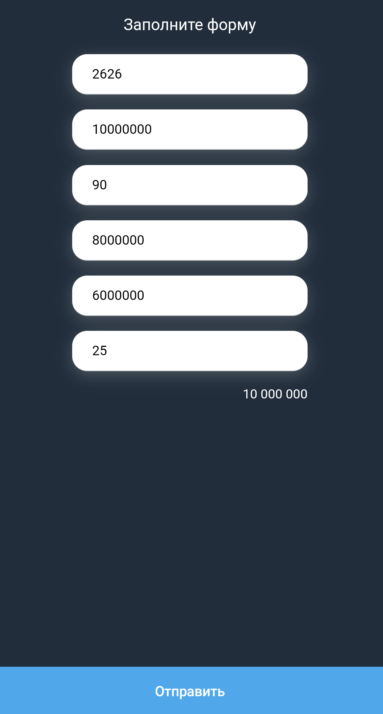
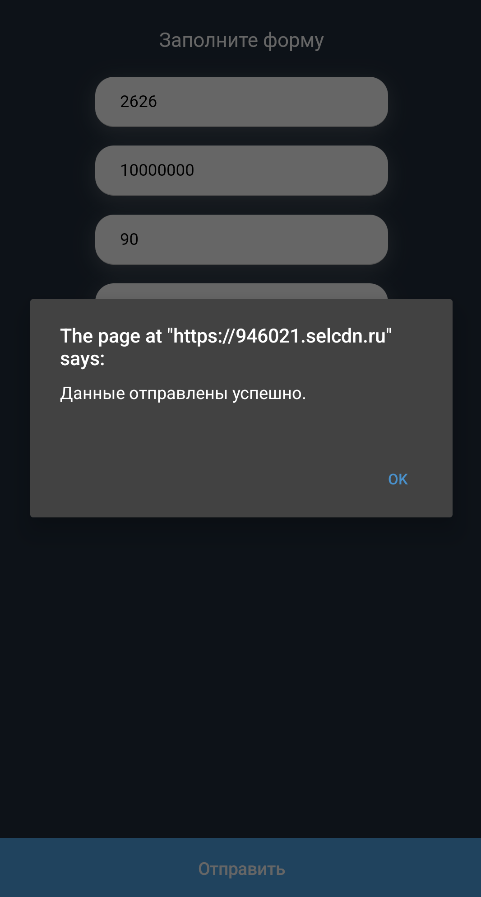
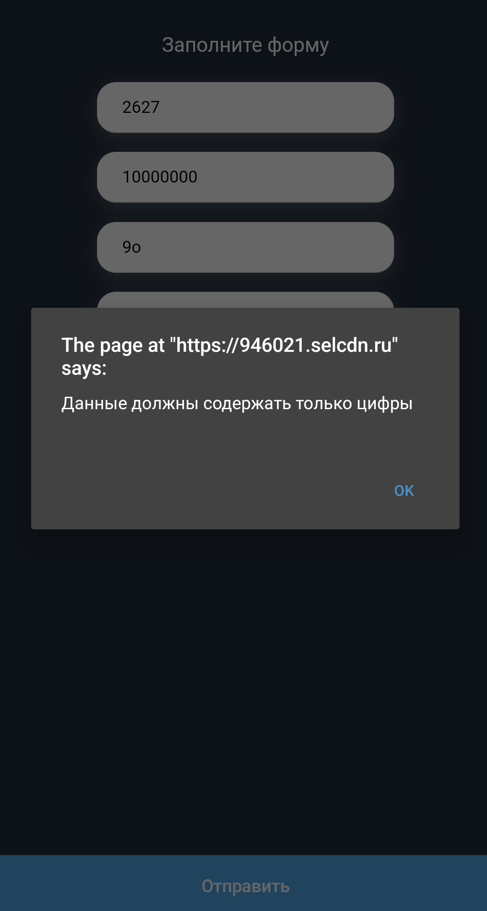
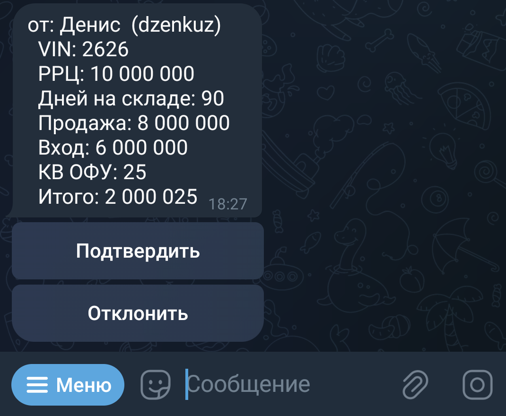
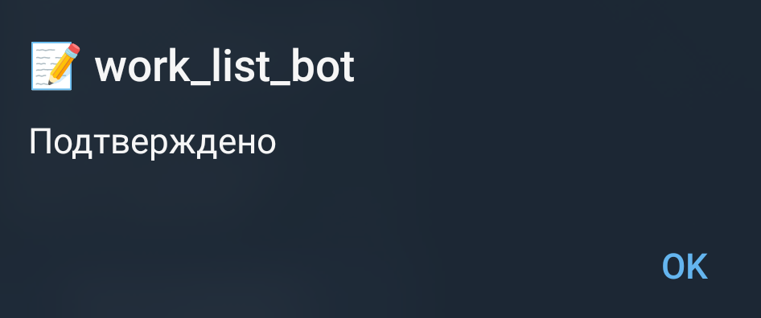
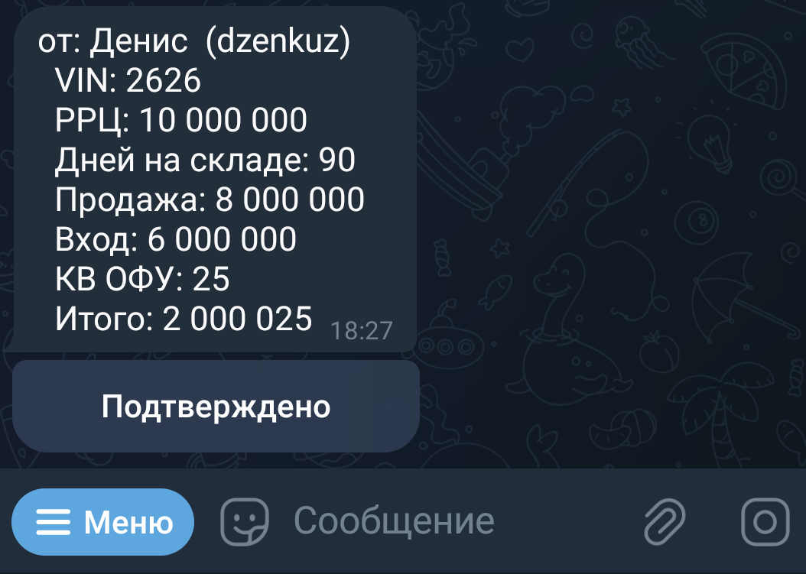
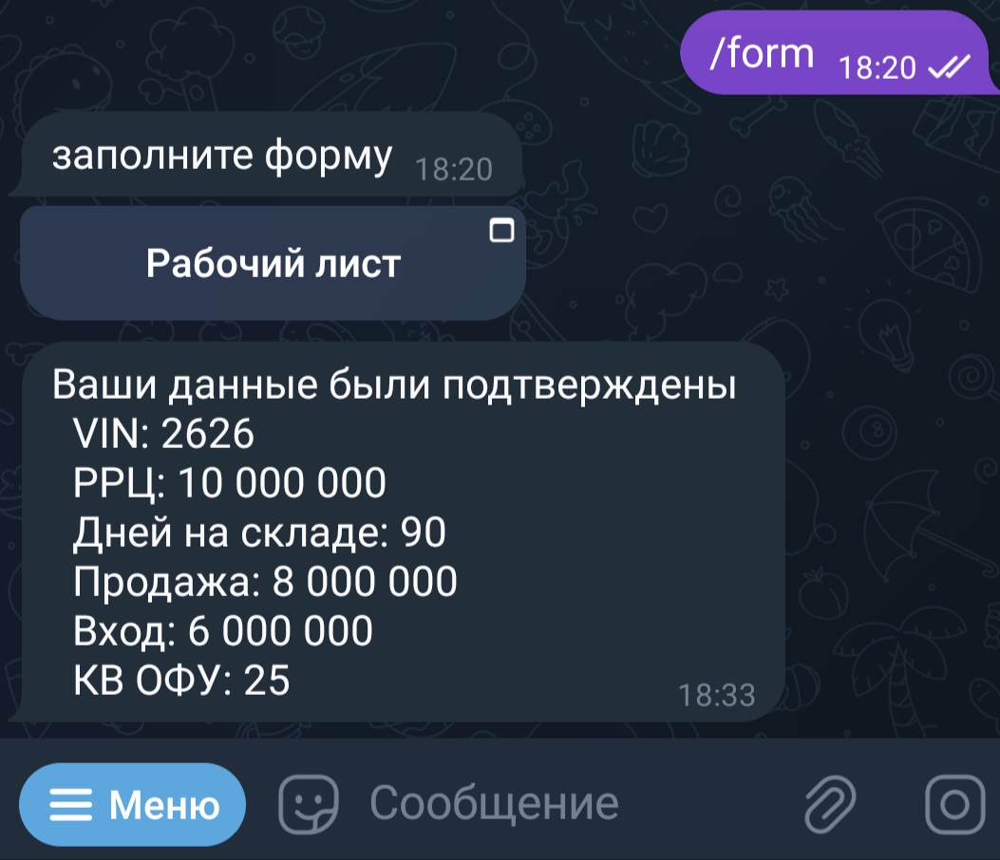

# Tgelegram WebApp approver_bot

## Описание

Приложение представляет из себя электронную версию отчета, который составляют менеджеры одного из автосалонов. Перенос документа в WebApp гарантирует заполнение всех полей формы и увеличивает скорость оформления/обработки отчета, повышая эффективность рабооы отдела продаж.

## Функциональные возможности

-   **Доступные команды**: При наличии разрешения на доступ к боту, у пользователя появляется возможность использовать следующие команды:

            /start - запуск бота,
            /info - информация об ID пользователя и чата для возможности получения доступа (команда доступна для всех пользовательей),
            /form - вызов формы для заполнения отчета (только для подтвержденных пользователей),

    Если у пользователя нет разрешения, то при отправке любого сообщения или команды (кроме `/info`), выводится соответствующее уведомление _("you have no permission to use this bot")_

    

        
    

-   **Отправка данных**: После заполнения всех полей формы становится доступна кнопка *"Отправить"*. При нажатии на нее данные проходят валидацию и отправляются администратору для дальнейшей обработки.
    

        
        
        
    

-   **Обработка ошибок**: Если данные содержат ошибки, то пользователь получает соответствующее сообщение об ошибке.

    

        
    

-   **Подтверждение или отклонение данных администратором**: Администратор получает отправленные данные с дополнительным полем _"Итого"_, рассчитанным по определенной формуле на сервере. Он может подтвердить или отклонить полученные данные.

    

        
        
        
    

-   **Обратная связь пользователю**: После действия администратора пользователь получает сообщение о результате обработки его данных в виде личного сообщения от бота.

    

        
    

